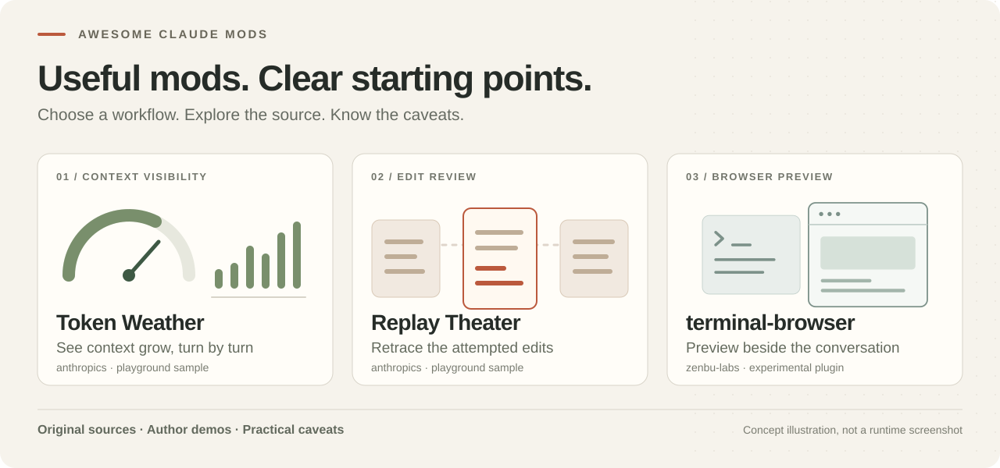

# Awesome Claude Mods

按你眼前的任务选择 Claude Code Mod：看上下文增长、复盘修改尝试，或在会话旁预览网站。原作者源码、演示原帖、版本依据与使用限制，一处查清。

[English](README.md) · [浏览案例索引](#案例索引) · [版本兼容说明](docs/COMPATIBILITY.md) · [评估案例](cases/README.md) · [X 原帖](docs/X_SHOWCASE.md) · [参与贡献](CONTRIBUTING.md)

**检查日期：2026-10-02。** 共 19 个目录条目：3 个 Anthropic 示例、9 个社区精选、4 个内置实现参考、3 个许可证待澄清项目。X 案例另收录 terminal-browser。已核对文档与模块入口，**没有安装、运行或实测这些 Mods**；收录不代表安全审计或兼容性保证。

## 从这三个场景开始

先选需求，再看原始演示，试用前核对源码和限制。

| 你想做什么 | 先看这个 | 使用前注意 |
| --- | --- | --- |
| **一眼看懂上下文增长** | **Token Weather** · anthropics 用轻量用量提示与近期轮次小图观察上下文。 [原作者源码](https://github.com/anthropics/claude-code-playground/tree/main/claude-code/mods/token-weather) · [官方发布者演示](https://x.com/ClaudeDevs/status/2105721436270993609) | 每轮结束后更新；完整窗口用量百分比不等于自动压缩阈值。 |
| **理解一轮修改是怎么完成的** | **Replay Theater** · anthropics 按顺序回看上一轮的修改尝试。 [原作者源码](https://github.com/anthropics/claude-code-playground/tree/main/claude-code/mods/replay-theater) · [官方发布者演示](https://x.com/ClaudeDevs/status/2105721439206994232) | 可能包含被拒绝或失败的尝试，差异展示会截断；还应核对最终 Git diff。 |
| **在会话旁预览网站** | **terminal-browser** · zenbu-labs / Rob Knight 在 Claude Code 侧栏打开真实浏览器。 [原作者源码](https://github.com/zenbu-labs/terminal-browser/tree/main/claude-code-plugin) · [作者演示](https://x.com/RobKnight__/status/2100622380439683541) | 实验性项目，依赖独立程序和支持 kitty 图形协议及 Unicode 占位符的终端；多路复用器与布局存在限制。 |

Token Weather 和 Replay Theater 是 Anthropic 发布的教学示例，**不是受支持产品**。terminal-browser 是另一个社区实验项目，详见 [X 案例说明](docs/X_SHOWCASE.md)。

**还有这些需求：**想看更完整的会话面板，可研究 [cctop](https://github.com/tomstagl/cctop/tree/main/plugin)；跟踪 PR 评审和必需检查，可研究 [cc-pr-tracker](https://github.com/sezaakgun/cc-pr-tracker)；在终端看支持的流程图，可研究 [claude-mermaid](https://github.com/galElmalah/claude-mods/tree/main/claude-mermaid)。

先阅读[评估步骤](cases/README.md)，再选一个试用。示例步骤不是已经完成的测试报告。

## X 原帖精选

新增五个作者本人或官方发布者的案例原帖，按场景分类；[完整双语案例与风险说明](docs/X_SHOWCASE.md)。核对了来源和真实 Mod 入口，未复现视频或运行测试。

- 上下文可视化：[Token Weather 原帖](https://x.com/ClaudeDevs/status/2105721436270993609)（@ClaudeDevs，2026-10-01）
- 修改审阅：[Replay Theater 原帖](https://x.com/ClaudeDevs/status/2105721439206994232)（@ClaudeDevs，2026-10-01）
- 命令影响预览：[Blast Radius 原帖](https://x.com/ClaudeDevs/status/2105721437701259338)（@ClaudeDevs，2026-10-01）
- 界面与等待体验：[Mindful Claude 原帖](https://x.com/halluton/status/2099640486130835845)（@halluton，2026-09-14）
- 内嵌浏览器与预览：[terminal-browser 原帖](https://x.com/RobKnight__/status/2100622380439683541)（@RobKnight__，2026-09-17）

其中 terminal-browser 是额外收录的实验性内嵌浏览器案例，需要独立程序及合适的终端图形支持。三个 Anthropic 示例并非受支持产品。

## 安装前必读

截至检查日，[官方说明](https://code.claude.com/docs/en/plugins/mods/overview)要求 Claude Code **2.1.287+**，默认启用 Mods。早期的 CLAUDE_CODE_ENABLE_FUNCTION_HOOKS 在该版本范围被忽略，设为 0 也不能关闭 Mods。很多社区 README 尚未更新，不能直接照搬旧步骤。

Mods 可使用当前账户权限，也可能消耗模型用量。先在临时项目里检查权限范围，一次只评估一个。详见[兼容性和检查清单](docs/COMPATIBILITY.md)。

## 案例索引

### Anthropic 发布的实验示例

这些示例不是有官方支持的产品；仓库采用 Apache-2.0。

- [Token Weather](https://github.com/anthropics/claude-code-playground/tree/main/claude-code/mods/token-weather)（anthropics）：用一行天气提示和历史小图显示上下文用量。
- [Replay Theater](https://github.com/anthropics/claude-code-playground/tree/main/claude-code/mods/replay-theater)（anthropics）：逐步查看上一轮文件修改尝试。
- [Blast Radius](https://github.com/anthropics/claude-code-playground/tree/main/claude-code/mods/blast-radius)（anthropics）：对部分高风险 Bash 命令展示影响并等待选择。

### 社区精选

- [cctop](https://github.com/tomstagl/cctop/tree/main/plugin)（tomstagl）：查看上下文、用量、工具和子代理状态的综合面板。
- [cc-pr-tracker](https://github.com/sezaakgun/cc-pr-tracker)（sezaakgun）：在会话里查看 PR、评审和必需检查状态。
- [aside](https://github.com/JayDoubleu/aside)（JayDoubleu）：在侧栏询问当前会话，不把问题加入主对话。
- [claude-mermaid](https://github.com/galElmalah/claude-mods/tree/main/claude-mermaid)（galElmalah）：把支持的 Mermaid 图表直接画成终端字符图。
- [Mindful Claude](https://github.com/halluton/Mindful-Claude)（halluton）：在等待回复时显示呼吸节奏动画。
- [cc-arcade](https://github.com/sezaakgun/cc-arcade)（sezaakgun）：Claude 工作时玩终端小游戏，回合结束时暂停。
- [fable-pin](https://github.com/karanb192/claude-code-mods/tree/main/plugins/fable-pin)（karanb192）：统一非 fork 子代理的目标模型。
- [cache-tax](https://github.com/karanb192/cache-tax)（karanb192）：提醒缓存冷启动成本，并可选发送保温请求。
- [secret-redactor](https://github.com/ray-amjad/awesome-claude-code-function-hooks/tree/main/plugins/secret-redactor)（ray-amjad）：在模型输入前按规则替换敏感字符串，并可恢复工具输入。

### 内置实现参考

用于学习实现，不建议重复安装；主仓库不是 MIT 许可。

- [diff](https://github.com/anthropics/claude-code/tree/main/mods/diff)（anthropics）：内置文件差异与修改块面板。
- [agents-md](https://github.com/anthropics/claude-code/tree/main/mods/agents-md)（anthropics）：按照策略加载 AGENTS.md 项目指令。
- [sec-default](https://github.com/anthropics/claude-code/tree/main/mods/sec-default)（anthropics）：让组织管理的策略不被用户安装的 Mod 覆盖。
- [telemetry](https://github.com/anthropics/claude-code/tree/main/mods/telemetry)（anthropics）：为内置功能提供第一方遥测钩子。

### 许可证待澄清

仅链接供研究；未复制或分发代码。

- [token-ledger](https://github.com/Arunjay4213/claude-mods/tree/main/plugins/token-ledger)（Arunjay4213）：轻量成本、token 与缓存命中率账本。
- [context-lens](https://github.com/Arunjay4213/claude-mods/tree/main/plugins/context-lens)（Arunjay4213）：检查上下文用量、分类和近期增长。
- [gh-ci-status](https://github.com/diegorv/claude-functions-hook/tree/main/plugins/gh-ci-status)（diegorv）：展示当前仓库的 GitHub Actions 和 PR 链接。

## 不能忽略的限制

- Blast Radius 只识别部分命令，不是沙箱或完整权限边界；迁移预览也可能加载项目代码
- Replay Theater 会记录失败或被拒绝的修改尝试，不能用它代替最终文件检查
- aside 和 cache-tax 会调用模型；“只读”或“保温”不等于免费
- secret-redactor 是启发式脱敏，不能保证不会泄漏秘密
- token-ledger、context-lens 的 MIT/ISC 声明存在冲突；gh-ci-status 尚未找到许可证声明
- 界面型 Mods 可能争用同一个显示区域；具体终端、桌面或无界面模式支持需逐项确认

逐项版本声明、许可证依据和检查范围见[证据矩阵](docs/EVIDENCE.md)及 [data/mods.json](data/mods.json)。上游说“已测试”与本指南亲自实测是两回事。

## 为什么再做一个指南

[awesome-claude-code-mods](https://github.com/karanb192/awesome-claude-code-mods)擅长广泛发现和能力扫描。本指南侧重“解决什么问题、适合谁、哪些版本信息已过时、怎样验证效果”。不按星数堆链接，不把别人的扫描结果当成自己的测试，也不把普通 skills、MCP 或设置型 hooks 混充 Mods。

[karanb192/claude-code-mods](https://github.com/karanb192/claude-code-mods)是相关市场和工具集，其中 mod-builder 是辅助编写 Mod 的 skill。感谢这些项目帮助发现候选案例。

欢迎按[贡献指南](CONTRIBUTING.md)提交有版本、日志和复现步骤的真实结果。本合集未另行授予统一许可证，链接收录不会改变上游权利；参见[发布清单](docs/PUBLISHING.md)。
