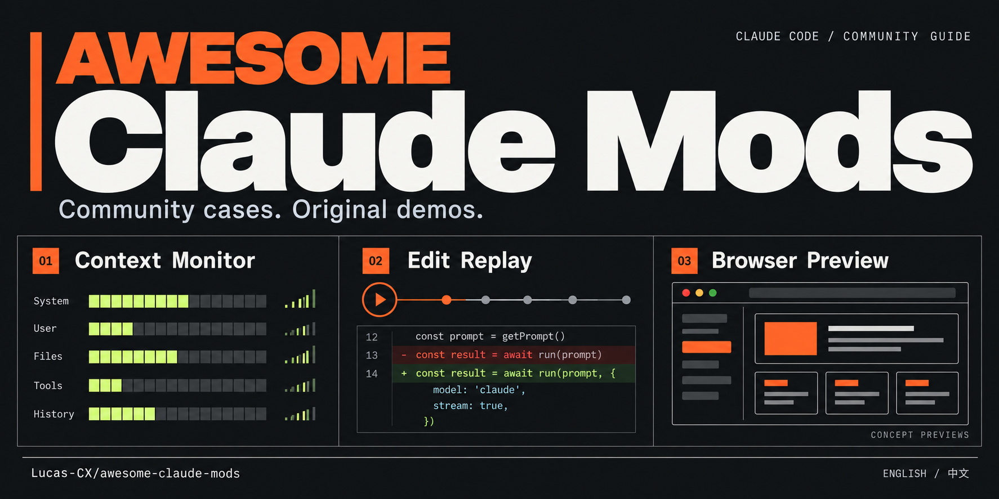

# Awesome Claude Mods

按你眼前的任务选择 Claude Code Mod：看上下文增长、复盘修改尝试，或在会话旁预览网站。原作者源码、演示原帖、版本依据与使用限制，一处查清。

[English](README.md) · [直接看演示](#直接看两个演示) · [浏览案例索引](#案例索引) · [版本兼容说明](docs/COMPATIBILITY.md) · [评估案例](cases/README.md) · [X 原帖](docs/X_SHOWCASE.md) · [参与贡献](CONTRIBUTING.md)

**检查日期：2026-10-02。** 共 19 个目录条目：3 个 Anthropic 示例、9 个社区精选、4 个内置实现参考、3 个许可证待澄清项目。X 案例另收录 terminal-browser，共涉及 20 个不同 Mod。只有下方注明的 5 个项目核验了演示／发布原帖；19 个目录条目不等于 19 个可直接安装的推荐。已核对文档与模块入口，**没有安装、运行或实测这些 Mods**；收录不代表安全审计或兼容性保证。

## 直接看两个演示

点击播放即可在 README 内观看。播放器引用作者原先上传到 GitHub 的视频；GitHub 可能默认静音。

### terminal-browser · 在 Claude Code 里打开浏览器

在 Claude Code 侧栏打开真实浏览器。**作者：** zenbu-labs / @RobKnight__。[上游演示与安装说明](https://github.com/zenbu-labs/terminal-browser/blob/main/claude-code-plugin/README.md) · [单独打开原视频](https://github.com/user-attachments/assets/a79e7667-6fcb-49a4-9967-44d0f942102c)。

https://github.com/user-attachments/assets/a79e7667-6fcb-49a4-9967-44d0f942102c

**使用前注意：** 实验性项目，依赖独立程序和支持相应 kitty 图形能力的终端；具体限制见上游说明。

### One sentence. One plugin. · 现场构建脱敏钩子

来自最初 Mods 提案的短案例：Claude 编写、校验并加载一个钩子，在模型读取工具输出前遮蔽其中的秘密值。**作者：** [@poteat](https://github.com/poteat)。[原始提案与演示](https://github.com/anthropics/claude-code/issues/91870) · [单独打开原视频](https://github.com/user-attachments/assets/44601a4e-a4b4-4e0b-b1d2-4621293b8150)。

https://github.com/user-attachments/assets/44601a4e-a4b4-4e0b-b1d2-4621293b8150

**演示背景：** 为 2026 年 9 月 3 日提案录制的早期原型，用于说明机制，不是当前版本安装教程，也不构成完整的隐私保护保证。

## 从这三个场景开始

先选需求，再看原始演示，试用前核对源码和限制。

### 1. 一眼看懂上下文增长

**Token Weather** · anthropics

用轻量用量提示与近期轮次小图观察上下文。

[原作者源码](https://github.com/anthropics/claude-code-playground/tree/main/claude-code/mods/token-weather) · [官方发布者演示](https://x.com/ClaudeDevs/status/2105721436270993609)

**使用前注意：** 每轮结束后更新；完整窗口用量百分比不等于自动压缩阈值。

### 2. 理解一轮修改是怎么完成的

**Replay Theater** · anthropics

按顺序回看上一轮的修改尝试。

[原作者源码](https://github.com/anthropics/claude-code-playground/tree/main/claude-code/mods/replay-theater) · [官方发布者演示](https://x.com/ClaudeDevs/status/2105721439206994232)

**使用前注意：** 可能包含被拒绝或失败的尝试，差异展示会截断；还应核对最终 Git diff。

### 3. 在会话旁预览网站

**terminal-browser** · zenbu-labs / @RobKnight__

在 Claude Code 侧栏打开真实浏览器。

[原作者源码](https://github.com/zenbu-labs/terminal-browser/tree/main/claude-code-plugin) · [作者演示](https://x.com/RobKnight__/status/2100622380439683541)

**使用前注意：** 实验性项目，依赖独立程序和支持 kitty 图形协议及 Unicode 占位符的终端；多路复用器与布局存在限制。

Token Weather 和 Replay Theater 是 Anthropic 发布的教学示例，**不是受支持产品**。terminal-browser 是另一个社区实验项目，详见 [X 案例说明](docs/X_SHOWCASE.md)。

**还有这些需求：** 想看更完整的会话面板，可研究 [cctop](https://github.com/tomstagl/cctop/tree/main/plugin)；跟踪 PR 评审和必需检查，可研究 [cc-pr-tracker](https://github.com/sezaakgun/cc-pr-tracker)；在终端看支持的流程图，可研究 [claude-mermaid](https://github.com/galElmalah/claude-mods/tree/main/claude-mermaid)。

先阅读[评估步骤](cases/README.md)，再选一个试用。示例步骤不是已经完成的测试报告。

## X 原帖精选

新增五个作者本人或官方发布者的案例原帖，按场景分类；[完整双语案例与风险说明](docs/X_SHOWCASE.md)。核对了来源和真实 Mod 入口，未复现视频或运行测试。

- 上下文可视化：[Token Weather 原帖](https://x.com/ClaudeDevs/status/2105721436270993609)（@ClaudeDevs，2026-10-01）
- 修改审阅：[Replay Theater 原帖](https://x.com/ClaudeDevs/status/2105721439206994232)（@ClaudeDevs，2026-10-01）
- 命令影响预览：[Blast Radius 原帖](https://x.com/ClaudeDevs/status/2105721437701259338)（@ClaudeDevs，2026-10-01）
- 界面与等待体验：[Mindful Claude 原帖](https://x.com/halluton/status/2099640486130835845)（@halluton，2026-09-14）
- 内嵌浏览器与预览：[terminal-browser 原帖](https://x.com/RobKnight__/status/2100622380439683541)（@RobKnight__，2026-09-17）

其中 terminal-browser 是额外收录的实验性内嵌浏览器案例，需要独立程序及合适的终端图形支持。三个 Anthropic 示例并非受支持产品。

## 安装前必读

截至检查日，[官方说明](https://code.claude.com/docs/en/plugins/mods/overview)要求 Claude Code **2.1.287+**，默认启用 Mods。早期的 CLAUDE_CODE_ENABLE_FUNCTION_HOOKS 在该版本范围被忽略，设为 0 也不能关闭 Mods。很多社区 README 尚未更新，不能直接照搬旧步骤。

Mods 可使用当前账户权限，也可能消耗模型用量。先在临时项目里检查权限范围，一次只评估一个。详见[兼容性和检查清单](docs/COMPATIBILITY.md)。

## 案例索引

按来源类型分层，再按使用场景细分。每项统一列出做什么、适合场景、条件与限制、源码／说明和演示状态。**所有条目均未由本指南运行测试。**

## Anthropic 发布的实验示例

这些是 Anthropic 发布的教学示例，**不是受支持产品**；采用 [Apache-2.0](https://github.com/anthropics/claude-code-playground/blob/main/LICENSE)。

### Token Weather · anthropics

- **做什么:** 用一行天气提示和历史小图显示上下文用量。
- **适合场景:** 长会话中随时观察上下文增长。
- **条件与限制:** 每轮结束后更新；完整窗口用量百分比不等于自动压缩阈值。可能与其他 AbovePrompt 顶部提示争用区域。
- **入口:** [源码](https://github.com/anthropics/claude-code-playground/tree/main/claude-code/mods/token-weather) · [上游说明／安装](https://github.com/anthropics/claude-code-playground/blob/main/claude-code/mods/token-weather/README.md) · 演示：[已核验原帖](https://x.com/ClaudeDevs/status/2105721436270993609)

### Replay Theater · anthropics

- **做什么:** 逐步查看上一轮文件修改尝试。
- **适合场景:** 审查最终 Git diff 前，先了解这一轮的修改过程。
- **条件与限制:** 记录的是修改尝试，包含失败或被拒绝的操作；不能证明文件最终状态。差异视图会截断，记录仅限当前会话。
- **入口:** [源码](https://github.com/anthropics/claude-code-playground/tree/main/claude-code/mods/replay-theater) · [上游说明／安装](https://github.com/anthropics/claude-code-playground/blob/main/claude-code/mods/replay-theater/README.md) · 演示：[已核验原帖](https://x.com/ClaudeDevs/status/2105721439206994232)

### Blast Radius · anthropics

- **做什么:** 对部分高风险 Bash 命令展示影响并等待选择。
- **适合场景:** 学习如何在部分高风险命令前加入人工确认。
- **条件与限制:** 只能识别部分命令，会漏掉包装脚本及部分 shell 语法；不是安全边界。迁移预览可能加载项目代码，上游说明部分后续修复未重新实测，仅在可丢弃项目中评估。
- **入口:** [源码](https://github.com/anthropics/claude-code-playground/tree/main/claude-code/mods/blast-radius) · [上游说明／安装](https://github.com/anthropics/claude-code-playground/blob/main/claude-code/mods/blast-radius/README.md) · 演示：[已核验原帖](https://x.com/ClaudeDevs/status/2105721437701259338)

## 社区精选

按具体需求和可核对的文档筛选，不按星数排名。保留原作者，当前版本运行兼容性未实测。

### 上下文与会话可视化

#### cctop · tomstagl

- **做什么:** 查看上下文、用量、工具和子代理状态的综合面板。
- **适合场景:** 编码时集中查看会话状态，减少切换。
- **条件与限制:** 基础上下文／成本／速率限制面板可不安装原生伴随程序；完整工具、文件、代理和 Advisor 面板依赖该程序。单独审查二进制安装及权限，部分指标是估算。
- **入口:** [源码](https://github.com/tomstagl/cctop/tree/main/plugin) · [上游说明／安装](https://github.com/tomstagl/cctop/blob/main/plugin/README.md) · [伴随程序安装](https://github.com/tomstagl/cctop) · 演示：本指南未核验演示原帖

#### aside · JayDoubleu

- **做什么:** 在侧栏询问当前会话，不把问题加入主对话。
- **适合场景:** 对当前会话追问细节，又不把问题加入主对话。
- **条件与限制:** 会读取会话记录并调用模型，可能消耗用量；主任务运行中打开的分支可能只包含上一轮已完成内容。“只读”不等于免费。
- **入口:** [源码](https://github.com/JayDoubleu/aside) · [上游说明／安装](https://github.com/JayDoubleu/aside/blob/main/README.md) · 演示：本指南未核验演示原帖

### 审阅与 CI

#### cc-pr-tracker · sezaakgun

- **做什么:** 在会话里查看 PR、评审和必需检查状态。
- **适合场景:** 写代码时持续关注 PR 评审和必需检查。
- **条件与限制:** 需要已登录且有目标仓库访问权的 gh；通过进程轮询 GitHub，刷新失败可能留下旧状态。
- **入口:** [源码](https://github.com/sezaakgun/cc-pr-tracker) · [上游说明／安装](https://github.com/sezaakgun/cc-pr-tracker/blob/main/README.md) · 演示：本指南未核验演示原帖

### 界面与等待体验

#### claude-mermaid · galElmalah

- **做什么:** 把支持的 Mermaid 图表直接画成终端字符图。
- **适合场景:** 在终端直接阅读支持的流程图或架构图。
- **条件与限制:** 并非支持所有 Mermaid 图表类型，过宽字符图可能被截断。链接已使用重定向后的规范目录。
- **入口:** [源码](https://github.com/galElmalah/claude-mods/tree/main/claude-mermaid) · [上游说明／安装](https://github.com/galElmalah/claude-mods/blob/main/claude-mermaid/README.md) · 演示：本指南未核验演示原帖

#### Mindful Claude · halluton

- **做什么:** 在等待回复时显示呼吸节奏动画。
- **适合场景:** 等待回复时显示轻量的节奏提示。
- **条件与限制:** 界面与专注体验实验，不宣称医疗收益；需检查与其他顶部提示区域的冲突。
- **入口:** [源码](https://github.com/halluton/Mindful-Claude) · [上游说明／安装](https://github.com/halluton/Mindful-Claude/blob/main/README.md) · 演示：[已核验原帖](https://x.com/halluton/status/2099640486130835845)

#### cc-arcade · sezaakgun

- **做什么:** Claude 工作时玩终端小游戏，回合结束时暂停。
- **适合场景:** 在 Claude 工作的等待时间玩小型终端游戏。
- **条件与限制:** 需要合适的终端输入与字体支持；其中的宠物会观察工具调用，界面用途不代表不会接触会话数据。
- **入口:** [源码](https://github.com/sezaakgun/cc-arcade) · [上游说明／安装](https://github.com/sezaakgun/cc-arcade/blob/main/README.md) · 演示：本指南未核验演示原帖

### 工作流、成本与隐私

#### fable-pin · karanb192

- **做什么:** 统一非 fork 子代理的目标模型。
- **适合场景:** 让非 fork 子代理使用指定的目标模型。
- **条件与限制:** 需确认配置中的模型别名对自己的账户可用；会改变模型选择及费用，上游说明错误可能导致某次启动未被固定到目标模型。
- **入口:** [源码](https://github.com/karanb192/claude-code-mods/tree/main/plugins/fable-pin) · [上游说明／安装](https://github.com/karanb192/claude-code-mods/blob/main/plugins/fable-pin/README.md) · 演示：本指南未核验演示原帖

#### cache-tax · karanb192

- **做什么:** 提醒缓存冷启动成本，并可选发送保温请求。
- **适合场景:** 观察缓存相关用量，研究保温策略是否适合自己的工作流。
- **条件与限制:** 进阶实验：保温请求会消耗用量，输出成本并不确定；缓存时长需与策略匹配。不能预设它一定省钱，也不要与传统 hook 版本同时安装。
- **入口:** [源码](https://github.com/karanb192/cache-tax) · [上游说明／安装](https://github.com/karanb192/cache-tax/blob/main/README.md) · 演示：本指南未核验演示原帖

#### secret-redactor · ray-amjad

- **做什么:** 在模型输入前按规则替换敏感字符串，并可恢复工具输入。
- **适合场景:** 用模拟敏感信息研究模型输入前的脱敏流程。
- **条件与限制:** 启发式规则会漏检，不能作为完整防泄漏屏障。内存密钥库会重置，默认会把占位符恢复到工具输入；只用模拟秘密评估。
- **入口:** [源码](https://github.com/ray-amjad/awesome-claude-code-function-hooks/tree/main/plugins/secret-redactor) · [上游说明／安装](https://github.com/ray-amjad/awesome-claude-code-function-hooks/blob/main/plugins/secret-redactor/README.md) · 演示：本指南未核验演示原帖

## 内置实现参考

用于学习实现，**不建议重复安装**。[主仓库许可证](https://github.com/anthropics/claude-code/blob/main/LICENSE.md)保留 Anthropic 条款下的权利，源码公开不等于 MIT 授权。

### diff · anthropics

- **做什么:** 内置文件差异与修改块面板。
- **适合场景:** 学习内置的 Git 差异审阅面板实现。
- **条件与限制:** 内置实现参考，不建议再装一份；涉及仓库文件、会话上下文与 Git。
- **入口:** [源码](https://github.com/anthropics/claude-code/tree/main/mods/diff) · [实现说明](https://github.com/anthropics/claude-code/blob/main/mods/diff/README.md) · 演示：本指南未核验演示原帖

### agents-md · anthropics

- **做什么:** 按照策略加载 AGENTS.md 项目指令。
- **适合场景:** 学习项目指令文件的加载方式与优先级。
- **条件与限制:** 指令加载受策略和会话模式影响，改写前先读上游行为说明。
- **入口:** [源码](https://github.com/anthropics/claude-code/tree/main/mods/agents-md) · [实现说明](https://github.com/anthropics/claude-code/blob/main/mods/agents-md/README.md) · 演示：本指南未核验演示原帖

### sec-default · anthropics

- **做什么:** 让组织管理的策略不被用户安装的 Mod 覆盖。
- **适合场景:** 研究组织管理策略与用户 Mod 的边界。
- **条件与限制:** 面向管理策略的参考；按普通用户层加载，不等于组织托管层的效果。
- **入口:** [源码](https://github.com/anthropics/claude-code/tree/main/mods/sec-default) · [实现说明](https://github.com/anthropics/claude-code/blob/main/mods/sec-default/README.md) · 演示：本指南未核验演示原帖

### telemetry · anthropics

- **做什么:** 为内置功能提供第一方遥测钩子。
- **适合场景:** 学习第一方事件接口与批量处理方式。
- **条件与限制:** 不是通用社区分析 SDK，也不是安装推荐；上游限制调用方，并遵循分析数据控制开关。
- **入口:** [源码](https://github.com/anthropics/claude-code/tree/main/mods/telemetry) · [实现说明](https://github.com/anthropics/claude-code/blob/main/mods/telemetry/README.md) · 演示：本指南未核验演示原帖

## 观察名单：许可证待澄清

与社区精选分开，仅供研究和源码核对，**不是安装推荐**；未复制或分发上游代码。

### token-ledger · Arunjay4213

- **做什么:** 轻量成本、token 与缓存命中率账本。
- **适合场景:** 研究比完整面板更轻量的用量记录方案。
- **条件与限制:** 复用前需澄清许可证：插件和 README 声称 MIT，根 package 声称 ISC，未找到许可证正文；会在本地保存历史。
- **入口:** [源码](https://github.com/Arunjay4213/claude-mods/tree/main/plugins/token-ledger) · [上游说明／安装](https://github.com/Arunjay4213/claude-mods/blob/main/plugins/token-ledger/README.md) · 演示：本指南未核验演示原帖

### context-lens · Arunjay4213

- **做什么:** 检查上下文用量、分类和近期增长。
- **适合场景:** 研究更细的上下文组成与变化视图。
- **条件与限制:** 同样有 MIT／ISC 声明冲突；主动刷新会发起 token 计数 API 请求，“距离压缩还有几轮”只是估算。
- **入口:** [源码](https://github.com/Arunjay4213/claude-mods/tree/main/plugins/context-lens) · [上游说明／安装](https://github.com/Arunjay4213/claude-mods/blob/main/plugins/context-lens/README.md) · 演示：本指南未核验演示原帖

### gh-ci-status · diegorv

- **做什么:** 展示当前仓库的 GitHub Actions 和 PR 链接。
- **适合场景:** 研究当前仓库的轻量 CI 状态提示。
- **条件与限制:** 未找到许可证声明或正文；需要已登录的 gh 和 GitHub remote，首次发现失败可能一直无提示直到重载。
- **入口:** [源码](https://github.com/diegorv/claude-functions-hook/tree/main/plugins/gh-ci-status) · [上游说明／安装](https://github.com/diegorv/claude-functions-hook/blob/main/README.md) · 演示：本指南未核验演示原帖

## 不能忽略的限制

- Blast Radius 只识别部分命令，不是沙箱或完整权限边界；迁移预览也可能加载项目代码
- Replay Theater 会记录失败或被拒绝的修改尝试，不能用它代替最终文件检查
- aside 和 cache-tax 会调用模型；“只读”或“保温”不等于免费
- secret-redactor 是启发式脱敏，不能保证不会泄漏秘密
- token-ledger、context-lens 的 MIT/ISC 声明存在冲突；gh-ci-status 尚未找到许可证声明
- 界面型 Mods 可能争用同一个显示区域；具体终端、桌面或无界面模式支持需逐项确认

逐项版本声明、许可证依据和检查范围见[证据矩阵](docs/EVIDENCE.md)及 [data/mods.json](data/mods.json)。上游说“已测试”与本指南亲自实测是两回事。

## 为什么再做一个指南

[awesome-claude-code-mods](https://github.com/karanb192/awesome-claude-code-mods)擅长广泛发现和能力扫描。本指南侧重“解决什么问题、适合谁、哪些版本信息已过时、怎样验证效果”。不按星数堆链接，不把别人的扫描结果当成自己的测试，也不把普通 skills、MCP 或设置型 hooks 混充 Mods。

[karanb192/claude-code-mods](https://github.com/karanb192/claude-code-mods)是相关市场和工具集，其中 mod-builder 是辅助编写 Mod 的 skill。感谢这些项目帮助发现候选案例。

欢迎按[贡献指南](CONTRIBUTING.md)提交有版本、日志和复现步骤的真实结果。本合集未另行授予统一许可证，链接收录不会改变上游权利；参见[发布清单](docs/PUBLISHING.md)。
